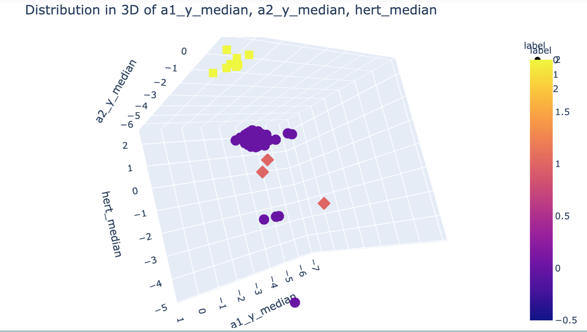

### Mission
Continuing previous work on the bearing analysis, guessing faulty bearings, the team came back for further expertise. They want to know what type of failures occur! Or rather, if the failures exhibit similarities to other failures.

### Content

 - For the experiments device shown on the picture was constructed. Two bearings were installed on the shaft. The rotation speed changed from 0 to 1500 rpm, was held for 10 seconds, and decreased to 250 rpm. 
 - The shaft was rotated using an DC motor connected to the shaft through a coupling. A radial load of 3.5 kg is applied to the shaft using a balanced weight.
The bearings were mounted on the shaft as shown in Figure 1. 
- GY-61 ADXL3353 accelerometers were mounted on the bearing housing 
- The sensor location is also shown in Figure. 
- The recording was saved along the x, y, z axes.
##### Datasets: 
   - bearing_signals.csv. Contains signals recordings.
   - bearing_classes.csv. Classes whole or defective for every bearing.

### Author:
* Minh Hien Vo (@minhhienvo368)

### Step 1: Data preprocessing

 - Using the cleaned data from previous classification assigment. 
 - Data description: contain 96 columns representatives of different features of experiments data (min, max, median, std, entropy, impulse factor, margin factor, frequence center, mean_square_frequency, root_mean_square_frequency, root_variance_frequency, crest_factor)  from the orginal features (a1_x, a2_x, a1_y, a2_y, a1_z, a2_z, hz (Hertz) and watt)
 - Generating sub-dataset to explore the correllation of features: df_max, df_min, df_median, df_entropy, df_mean_square_frequency, df_entropy
    + 'df_max' dataset description:
   
   
    + Heatmap of correlation between columns in 'df_max'
   

#### 1. KMean clustering methods:
 + **2 features**: Running automated loops to detect pairs with highest Silhouette score:

| # 2 features      | Clusters | Score |
| ------------------| -------- | ----- |
| a1_z_max, hert_max      | 2        | 0.822 | 
| a1_y_median, a2_y_median      | 2        | 0.873 |
| a1_x_MS_F, a2_x_MS_F      | 2        | 0.803 |
| a1_x_entropy, a1_y_entropy      | 2        | 0.591 |

  + Plotting of a1_y_median, a2_y_median:

   
   
   

 + **3 features**: a1_y_median, a2_y_median, hertz_median. **Silhouette score: 0.808**
    

 + **4 features**: a1_y_median, a2_y_median, 'hert_median', 'a1_x_median'. **Silhouette score: 0.793**
    
    
 + **5 features**: 'a1_x_median', 'a2_x_median','a1_y_median','a2_y_median', 'hert_median'.  **Silhouette score: 0.737**
    
    
 + **6 features**: 'a1_y_median', 'a2_y_median','a1_y_median','a2_y_median', 'hert_median', 'w_median'.  **Silhouette score: 0.791**
    
    
 #### Results of Kmeans corresponding with 2, 3, 4, 5 ,6-features: 
    Best silhouette scores for n features (KMeans++) using all the dataset
| # features | Clusters | Score |  
| ---------- | -------- | ----- |
| 2          | 2        | 0.873 | 
| 3          | 3        | 0.808 |
| 4          | 2        | 0.793 |
| 5          | 2        | 0.737 |
| 6          | 2        | 0.791 |

#### 2. DBSCAN clustering method:
*** With **2 features**: 'a1_y_median', 'a2_y_median', bearing_dbscan = DBSCAN(eps=0.5, min_samples=10)
  + Estimated number of clusters: 1
  + Estimated number of noise points: 5
  + Silhouette Coefficient for the Bearing Dataset Clusters: 0.79

*** With **3 features**: 'a1_y_median', 'a2_y_median','hert_median'
  + Estimated number of clusters: 1
  + Estimated number of noise points: 18
  + Silhouette Coefficient for the Bearing Dataset Clusters: 0.57

*** With **4 features**: a1_y_median','a2_y_median', 'hert_median', 'w_median'
  + Estimated number of clusters: 1
  + Estimated number of noise points: 44
  + Silhouette Coefficient for the Bearing Dataset Clusters: 0.24

#### 2. Spectral Clustering method:
*** With **2 features**: 'a1_y_median', 'a2_y_median'
  + Estimated number of clusters: 2
  + Estimated number of noise points: 0
  + Silhouette Coefficient: 0.884

*** With **3 features**: 'a1_y_median', 'a2_y_median','hert_median'
  + Estimated number of clusters: 4
  + Estimated number of noise points: 0
  + Silhouette Coefficient: 0.660

*** With **4 features**: 'a1_y_median', 'a2_y_median','hert_median'
  + Estimated number of clusters: 2
  + Estimated number of noise points: 0
  +Silhouette Coefficient: 0.814

### Conclusion 
  + The results show that the best scores of 2 features are with a cluster of size 2, and the silhouette score keeps decreasing as we increase the number of features used to cluster.
  + With the current dataset, the Kmeans method gives higher silhouette score than DBSCAN

# Timeline: 
09/08/2021 - 11/08/2021
